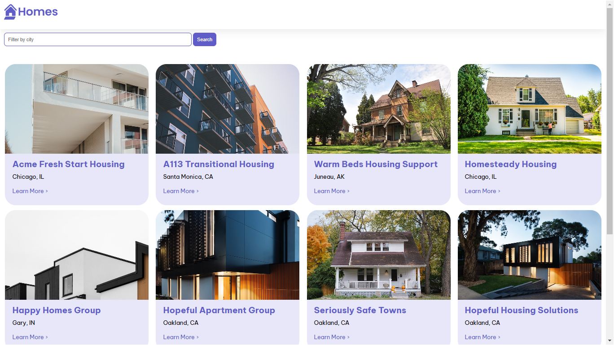
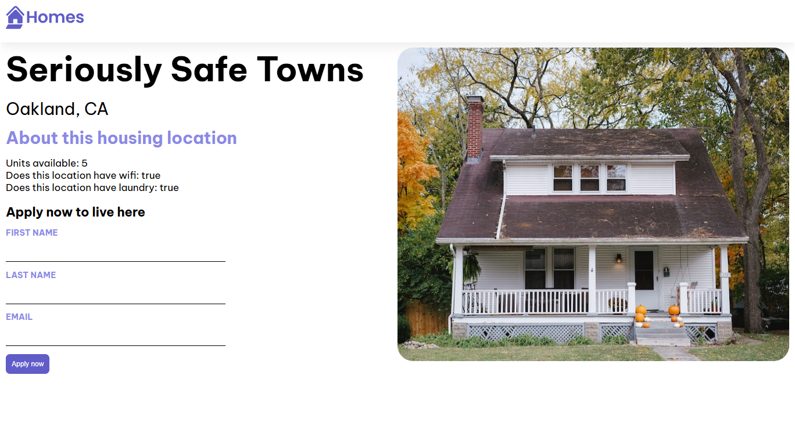

# 🏠 HomesApp – House Listing Web App

## 🖼️ Application Preview

### 🏠 Homes Listing



### 🏡 Property Details



---

## 📌 Project Overview

HomesApp is a responsive house listing web application developed using Angular.

The application provides a user-friendly interface for browsing house listings and exploring property information.

---

## 🎯 Project Objective

The objective of this project was to build a responsive web application that demonstrates Angular development, component-based architecture, routing, and responsive user interface design.

---

## ✨ Features

- 🏠 Browse house listings
- 🔍 Search properties
- 🔎 Filter property listings
- 📱 Responsive user interface
- 🧩 Component-based Angular structure
- 🧭 Application routing
- 🎨 Responsive HTML and CSS design

---

## 🛠️ Technologies Used

- Angular
- TypeScript
- HTML
- CSS
- JavaScript
- Git
- GitHub

---

## 📂 Project Structure

```text
Homes-App
│
├── assets/
├── public/
├── src/
├── angular.json
├── db.json
├── package.json
├── server.ts
└── README.md
